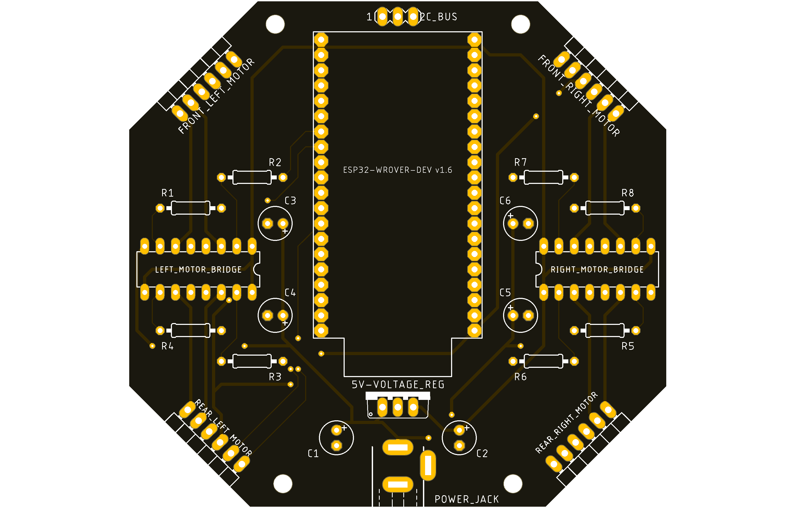

# Holonomic Car 1.0

## Overview
The aim of this repository is to present the neccesary code to control an Holonomic Car made out of an OSOYOO car, controlled with an ESP32-WROVER mounted on a costume made PCB.

This project was born out of a personal neccesity to bring into life a functional device on which recently learned concepts could be brough into play, with this project incorporating an electrical and software part.

The software, desktop apps as well as online services used throught the development of this project were:
- __PlatformIO / VS Code:__ to develop the necessary code to control the car, all the code was developed in C++.
- __Dabble:__ to provide a graphic interface, using Bluetooth, to control the car with a mobile phone. It was used with its complementary library in PlatformIO.
- __Eagle:__ to design the PCB so as to electrically drive the car without the need of a great number of jumpers and a breadboard, providing a cleaner version of the circuit.
- __Fusion 360:__ to provide a 3D preview of how the board will look like with all the components mounted.
- __UNIT electronics:__ to purchase the electrical components needed for the PCB.
- __PCBWay:__ to manufacture the PCB.

## Car   
The car used for this proyect was bought from *OSOYOO.com*, the specific model used is [M1 Metal Chassis Mecanum Wheel Robotic (for Arduino Mega2560) (Model ZZ012318MC)](https://osoyoo.com/2019/11/08/omni-direction-mecanum-wheel-robotic-kit-v1/), though it came with a variety of sensors and other complementary parts, this were to be replaced, specifically the Arduino Mega was dropped for the faster an more versatile ESP32 microcontroller.

## Microcontroller
As it was already mentioned, the Arduino Mega was dropped for an ESP32 microcontroller (ESP32-WROVER) as it offers more speed and is already embedded with Wifi and Bluetooth peripherals, all using a quarter of the space taken by the Arduino. Additionally due to its headers, it allows it to be mounted on a PCB.

<!-- PONER IMAGEN CON EL PINOUT DE LA PLACA -->

## PCB
In order to provide an easier and more compact way to drive the car, a PCB was design with the necessary components to drive the car (microcontroller, H-Bridges for the motors, 5V regulator to power the microcontroller); with the connections resulting as follows (Note that the library for the ESP-Wrover is custom made):

With the schematic done, the components where placed in its final position so as to get a functional yet eye appealing PCB, with the result being:

The components needed for this PCB, aside from the microcontroller, are:

|Component| Unit price (mxn) | Quantity | Subtotal (mxn) |
|:--:| :--:| :--:| :--:|
| 16-pin Socket               | 3 | 2 | 6 |
| 1x40 Female header          | 5 | 2 | 10 |
| 1x40 Male 90 degree header  | 7 | 2 | 14 |
| Female power socket         | 2 | 1 | 2 |
| 330-ohm resistor            | 0.3 | 8 | 2.4 |
| 100µF capacitor             | 2 | 6 | 12 |
| L7805CV 5V Regulator        | 10 | 1 | 10 |
||| __Total__ | 56.4 |

 
The prices of the components come from the UNIT electronics webpage.
Further, a render of the PCB was made in order to get a more detailed preview of how the board will look like. Note that the electronic parts used for this project are all through-hole due to its price and less complexity when soldering it to the board.

## Controlling the car
Once the PCB is finished with all the needed components, and properly mounted in position on top of the car, it can be easily moved with the help of the App __Dabble__, which allows an iphone to pair up with the car. First power on the car, then on the iphone go to:
*Dabble -> Gamepad -> Click on the connect icon -> Select "MecanumWheelCAR"*
Once this is done, you are ready to go.

## Future steps
Though the result achieved with the first step of this personal project is good enough, undoubtably further improvements can be implemented with this car, said improvements will be the following:

- Incorporate encoders for rpm control.
- Further insulate the ESP32 from the power electronics
- Change from ESP32-WROVER to ESP32-S3-DevKitC.
- Incorporate IMU data for redundancy.

